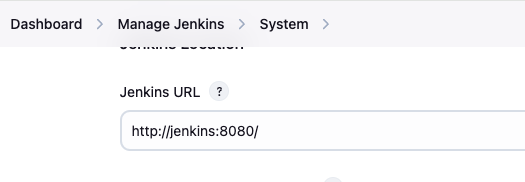
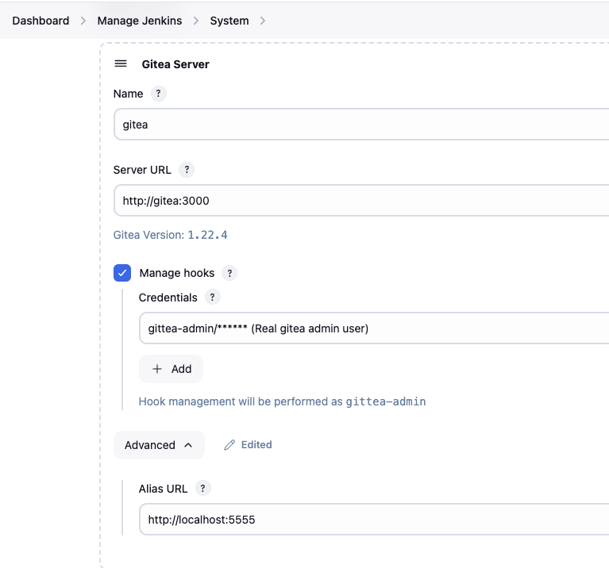

# Gittea and Jenkins
Co host Gitea and jenkins.  The Jenkins courses over on [KodeKloud](https://learn.kodekloud.com/) use these, but have not set up which makes it very difficult to follow along. I'm setting up an enviornment so I can better follow along and get more out of the course.

NOTE: Most of KodeKloud courses I've done have frequent labs, which is where I would have expected to exercise these, but the jenkins courses seem to have just a few large ones in case of Jenkins for Beginners, and unknown (haven't gotten there yet) ones for Jenkins Pipelines.

## Gitea
[Gitea](https://about.gitea.com/)
Private, fast, reliable devops platform... or just git source control.

## Jenkins
[Jenkins](https://www.jenkins.io/)
Leading opensource automation server.

## Problematic Areas
I ran into a number  difficulties getting jenkins and Gitea to talk to each other.
I gave jenkins a container name I could use as it's hostname.
```yaml
jenkins:
    container_name: jenkins
```

 * I added config to gitea to allow it to send webhooks.
 * add the localhost alias to git server config **Dashboard/Manage Jenkins/System** so jenkins recognized the 
```yaml
...
environment:
# https://docs.gitea.com/next/administration/config-cheat-sheet#webhook-webhook
- GITEA__webhook__ALLOWED_HOST_LIST=jenkins # loopback also valid
- GITEA__webhook__SKIP_TLS_VERIFY=true
```
